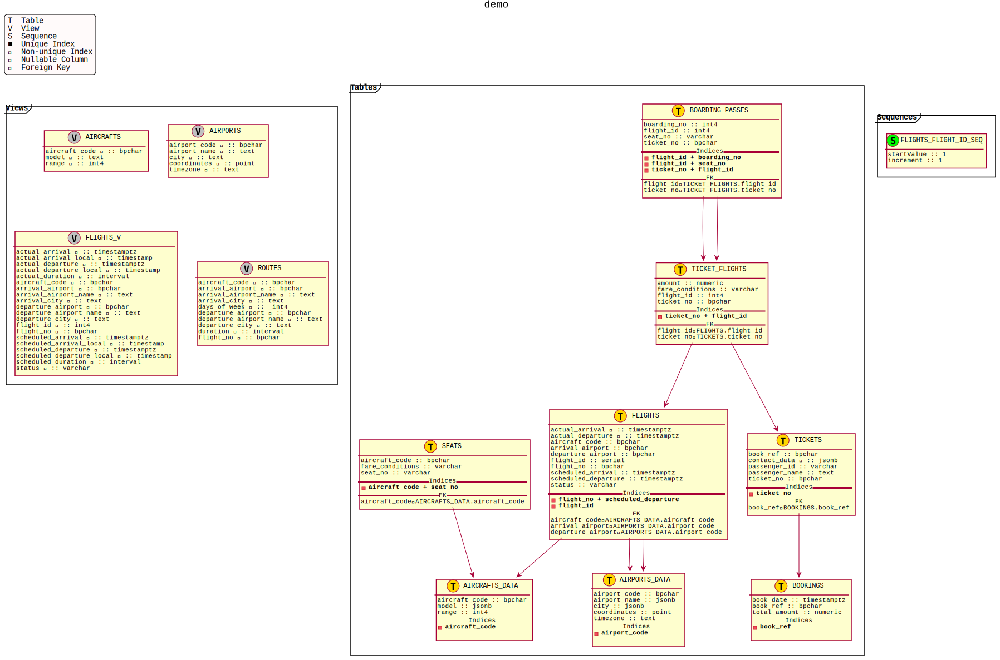

A utility for rendering the XML output of [Schemaspy](https://github.com/schemaspy/schemaspy) into a PlantUML diagram.


## Goal
In general, schema diagrams are low fidelity representations of the actual schema. The goal of this utility is 
to generate a diagram that provides the user with a general idea of what the actual schema is. Ultimately, the fine 
details are in that `.sql` file.


## The Schemaspy part

To generate the schema XML file, the Schemaspy jar is required. Version used here is `6.1.0` . It is available from
[GitHub](https://github.com/schemaspy/schemaspy/releases/download/v6.1.0/schemaspy-6.1.0.jar) 

Since we are not interested in HTML output the `-nohtml` parameter should be used. An invocation may look like this:

`java -jar schemaspy-6.1.0.jar -configFile ./schemaspy.config`

where `schemaspy.config` for Postgres may be:

```properties
schemaspy.nohtml
schemaspy.t=pgsql
schemaspy.dp=<HOME_DIR>/.m2/repository/org/postgresql/postgresql/42.2.16/postgresql-42.2.16.jar
schemaspy.host=localhost
schemaspy.port=5432
schemaspy.db=<DB_NAME>
schemaspy.u=<DB_USER>
schemaspy.p=<DB_PASSWORD>
schemaspy.o=<OUTPUT_DIR>/schemaspy_out
schemaspy.schemas=public
schemaspy.I=<STUFF_TO_IGNORE>
```

## Building
Checkout the project and execute `./gradlew clean build`. The `build/libs` directory will contain the fat jar `gesrep-<VERSION>-all.jar`

## Running
`java -jar build/libs/gesrep-<VERSION>.jar <PATH_TO_SCHEMA_XML_FILE> <PATH_TO_OUTPUT_FILE>` Some sample schema XML files 
are in `test/resources` so you can try them out. 

This is the output from `test/resources/demo.bookings.xml` :



Because the output is a PlantUML file, it is possible to customise the "look and feel". For example try adding  

### License

Copyright 2021 David Soroko.

Licensed under the [Apache License, Version 2.0](http://www.apache.org/licenses/LICENSE-2.0)
